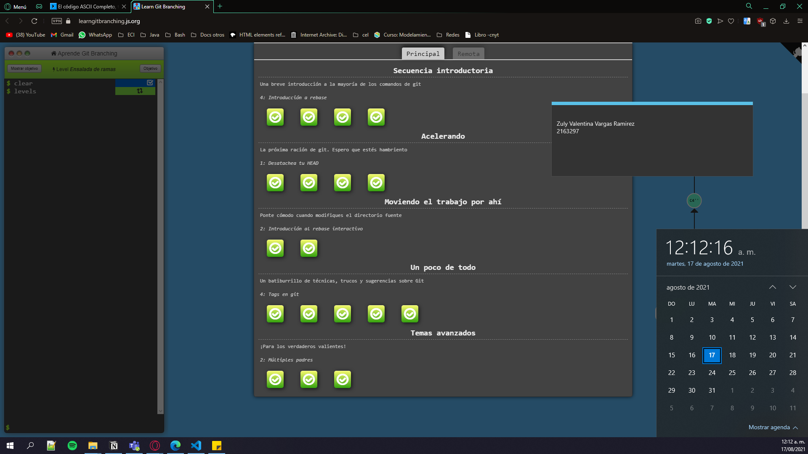
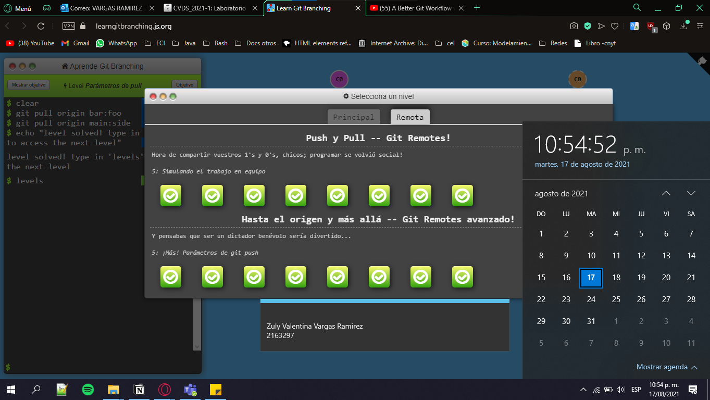

# **PARTE II-.**

## Zuly Valentina Vargas Ramirez 
_Estudiante Ingeniería de Sistemas_


## **Presentación :**

Hola, gracias por leerme. Mi nombre es Zuly Vargas, y me encuentro en séptimo semestre de ingeniería de sistemas en la Escuela Colombiana de Ingeniería Julio Garavito en Bogotá, Colombia. Tengo 20 años y pronto cumpliré los 21. Mis lenguajes de programación favoritos son _Java_ y _Python_. 

### Factorial de un número en Java:
```
    public class Factorial {
        public static void main(String[] args) {
        Scanner sc = new Scanner(System.in);
        int num = sc.nextInt();
        sc.close();
        System.out.println(factorial(num));
    }
        public static int factorial(int num){
            if(num == 0){
                return 1;
            }
            else
                return num * factorial(num-1);
                }
    }
    
```
### Factorial de un número en Python:
```
    def factorial(n):
        return n * factorial(n - 1) if n > 1 else 1
    def main():
        num = factorial(int(input()))
        print(num)
    main()
```
## Gustos personales:

### Series favoritas
Me gustan mucho las series y películas, entre mis series favoritas están:
-   Black Mirror
-   Greys Anatomy
-   The Office 
-   Brooklyn 99 
\

Algunas de mis películas favoritas son de Studio Ghibli:


### Mis cantantes y grupos favoritos:
Me gusta mucho escuchar música, estos son algunos de mis artistas favoritos junto a una canción que podría recomendar 
1. Twenty One Pilots - [Shy Away](https://open.spotify.com/track/1IabIaXAoATo0Rc4y8tdlz?si=d2dff4fb06734df4)     
2. Michael Jackson - [They Don't Care About Us]( https://open.spotify.com/track/3wuCCNCnBhJlwkIJTBZFiv?si=5556547e849640b3)
3. Madeon -  [Be Fine](https://open.spotify.com/track/7vm3Z78elWY11Xl6MNuXng?si=9d4b7cf31d2f43b1)
4. El Cuarteto De Nos - [Lo malo de ser bueno ](https://open.spotify.com/track/7xB3hSztVbX6xFvQqEGKud?si=8c77257f5d7241e4)


# PARTE III- GIT BRANCHING.
## LOCAL :

## REMOTO:

